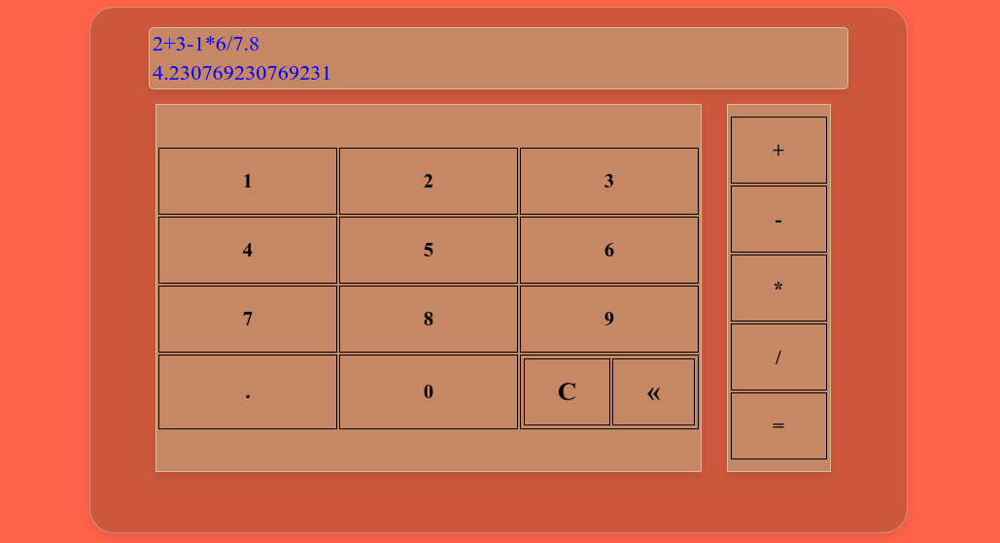

# Simple Calculator
This is a practice project to keep up my `HTML`, `CSS`, and `JavaScript` skills.

# Areas for Improvement

- Instead of using the `onclick` attribute for each `td` individually, I can use an `addEventListener`.
- Keyboard numbers and operators are not mapped to their corresponding `td` elements.
- The `calculatorCore` function only supports basic operations. To add scientific features like `sin`, `cos`, `sqrt`, etc., it would need to be rewritten or a new function must be defined alongside it.
- After getting the first answer, the user has to press **C** once or **«** multiple times to input new operations, which negatively affects the UX. 

# What I Learned 
During my web searches, I encountered the concept of `Event Listeners`, which provides a much easier and more optimized approach for handling user interactions.

# Technologies
* HTML5
* CSS
* JavaScript

# Preview
